# IAM Basics Lab - Solution

**Student Name:** Cielo Escobar 
**Date Completed:** 03/02/26

---

## Exercise 1: IAM Groups

### Screenshots:
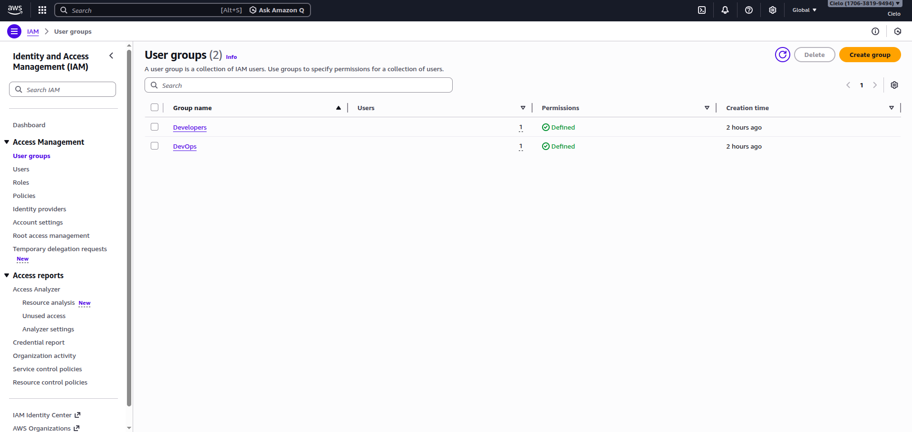

### Groups Created:
- [x] Developers group
- [x] DevOps group

---

## Exercise 2: Group Permissions

### Developers Group:


**Policies Attached:**
- AmazonS3FullAccess
- AmazonEC2ReadOnlyAccess

### DevOps Group:
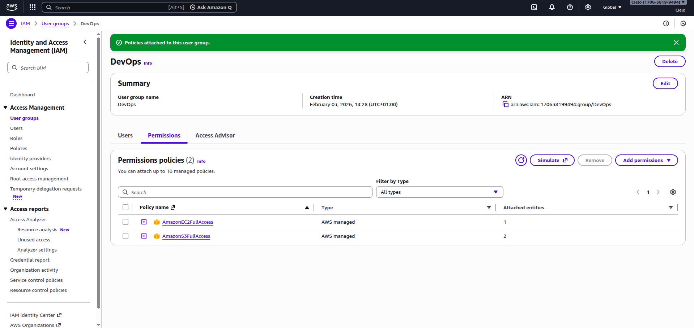

**Policies Attached:**
- AmazonS3FullAccess
- AmazonEC2FullAccess

---

## Exercise 3: IAM Users

### Screenshots:
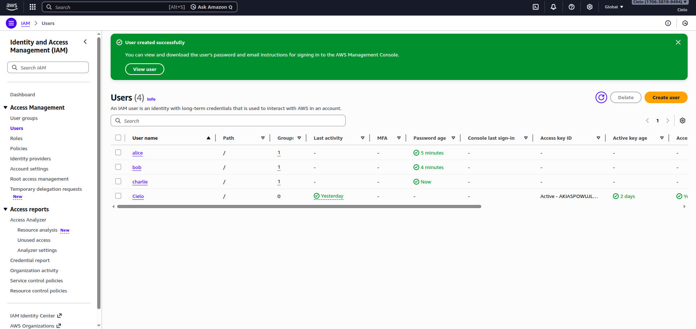

### Users Created:

| Username | Group | Console Access | Status |
|----------|-------|----------------|--------|
| alice | Developers | Yes | ✅ Created |
| bob | Developers | Yes | ✅ Created |
| charlie | DevOps | Yes | ✅ Created |

---

## Exercise 4: Permission Testing

### Alice's Access Tests:

**S3 Access:**
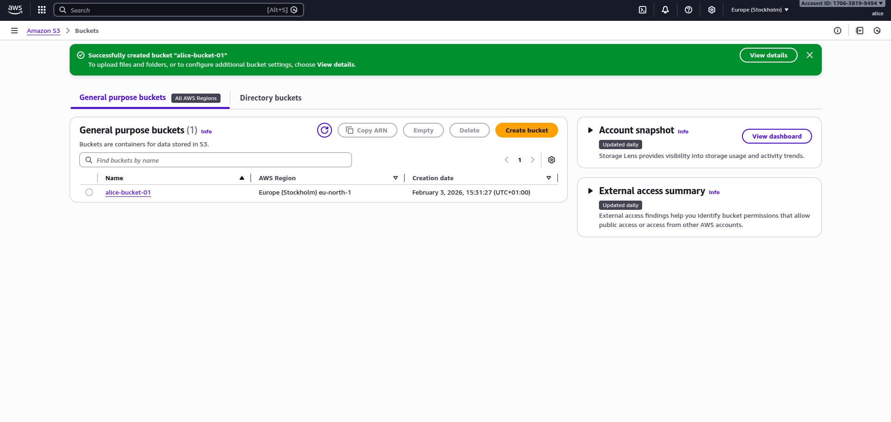
- Create bucket: ✅ SUCCESS
- Upload file: ✅ SUCCESS

**EC2 Access:**
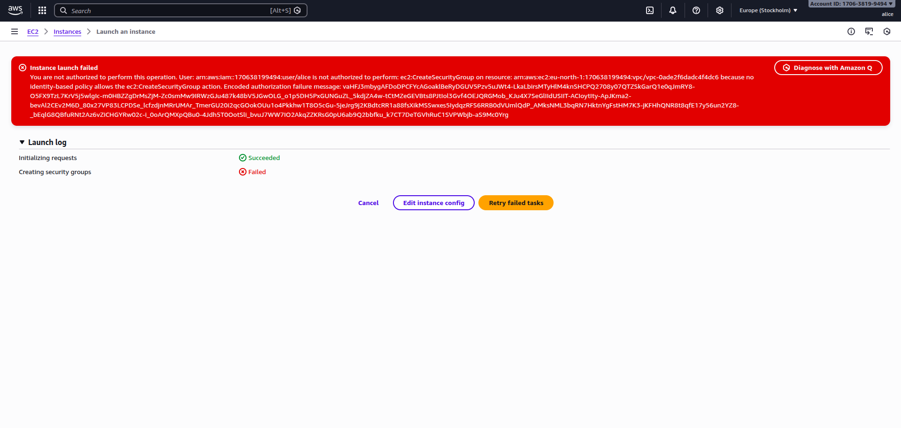
- View instances: ✅ SUCCESS
- Launch instance: ❌ DENIED (Expected)

### Bob's Access Tests:

**S3 Access:**

- Create bucket: ✅ SUCCESS

**EC2 Access:**
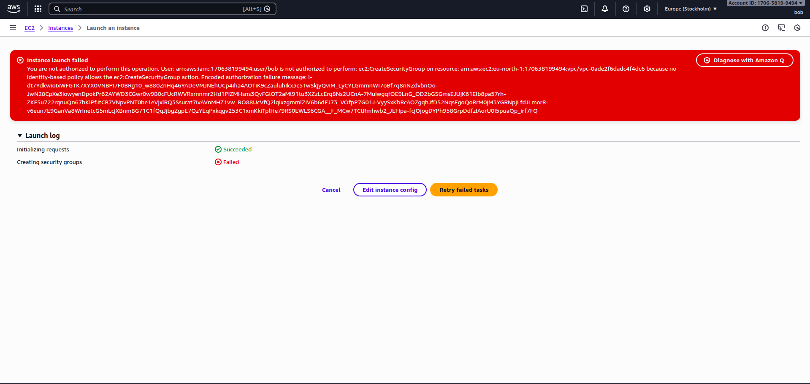
- View instances: ✅ SUCCESS
- Launch instance: ❌ DENIED (Expected)

### Charlie's Access Tests:

**Full Access:**
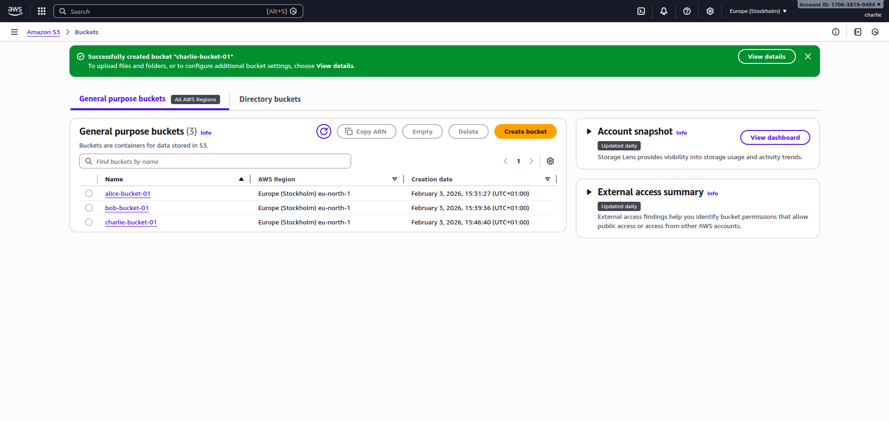
- S3 create bucket: ✅ SUCCESS
- EC2 launch instance: ✅ SUCCESS

### Summary of Test Results:

| User | S3 Full | EC2 View | EC2 Launch | Result |
|------|---------|----------|------------|--------|
| alice | ✅ | ✅ | ❌ | As expected |
| bob | ✅ | ✅ | ❌ | As expected |
| charlie | ✅ | ✅ | ✅ | As expected |

---

## Exercise 5: Custom Policy

### Policy JSON:
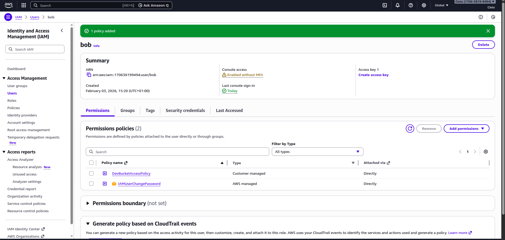

```json
{
    "Version": "2012-10-17",
    "Statement": [
        {
            "Sid": "ListAllBuckets",
            "Effect": "Allow",
            "Action": "s3:ListAllMyBuckets",
            "Resource": "*"
        },
        {
            "Sid": "DevBucketAccess",
            "Effect": "Allow",
            "Action": [
                "s3:ListBucket",
                "s3:GetObject",
                "s3:PutObject",
                "s3:DeleteObject"
            ],
            "Resource": [
                "arn:aws:s3:::dev-bucket",
                "arn:aws:s3:::dev-bucket/*"
            ]
        }
    ]
}
```

### Custom Policy Test:
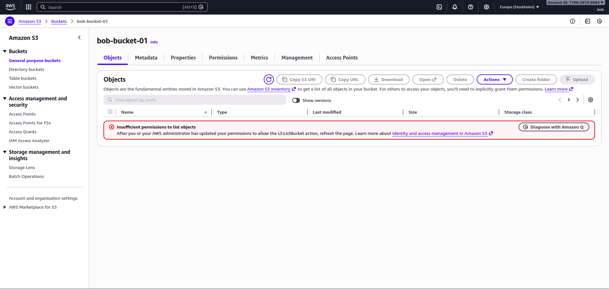

**Bob's Access After Custom Policy:**
- Access dev-bucket: ✅ SUCCESS
- Access other buckets: ❌ DENIED (Expected)

---

## Exercise 6: MFA Configuration


**MFA Details:**
- User: [alice / admin user]
- Device type: Virtual MFA
- Authenticator app: [Google Authenticator / Microsoft Authenticator / Authy]
- Status: ✅ Active

---

## Bonus Challenges

### Challenge 1: Password Policy

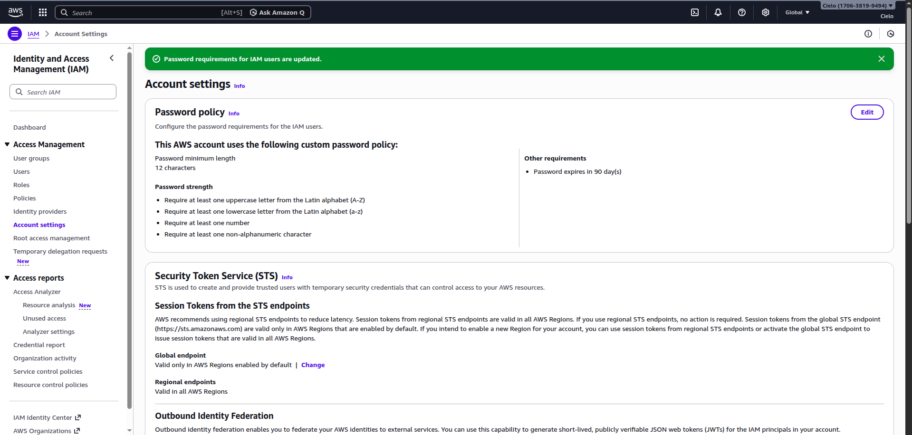

**Policy Settings:**
- [x] Minimum length: 12 characters
- [x] Require uppercase letters
- [x] Require lowercase letters
- [x] Require numbers
- [x] Require symbols
- [x] Password expiration: 90 days

---

### Challenge 2: Access Analyzer

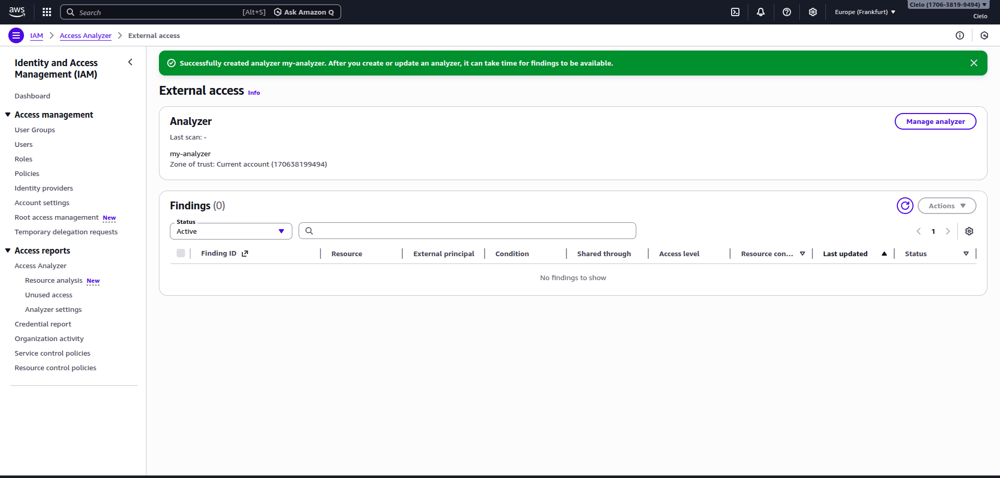

**Findings:**
- Number of findings: 0
- Critical issues: [List any public access found]
- Recommendations: [Your notes]

---

### Challenge 3: CLI Access Keys

**Alice Access Key Created:** [Yes / No]

**CLI Test Output:**
```bash
$ aws s3 ls --profile alice
[Paste output here]
```

**Screenshot:** [If applicable]

---

## Reflection Questions

### 1. Why use groups instead of attaching policies directly to users?

**Your Answer:**

Using groups makes it easier to manage permissions. Instead of giving the same permissions to each user one by one, I can add them to a group. If I need to change the permissions, I just update the group and everyone in it is updated automatically. It also keeps things organized and reduces mistakes.

---

### 2. What are the risks of giving everyone AdministratorAccess?

**Your Answer:**

If everyone has AdministratorAccess, anyone could accidentally delete resources, change settings, or spend money. It also makes the account less secure because one compromised user could affect everything. It’s better to give only the permissions each person needs.

---

### 3. How would you organize IAM for 50 developers across 5 projects?

**Your Answer:**

I would create groups for each project and assign the necessary permissions to the groups. Developers join the group for their project. For permissions that are common to all, I could make role-based groups. This way it’s easier to manage and I can control who has access to what.

---

### 4. What happens if you delete an IAM user? Can you recover their permissions?

**Your Answer:**

If you delete an IAM user, it’s permanent. The user cannot log in anymore and their permissions are gone. You can create a new user and give them the same permissions, but the history of what the old user did is lost.

---

## Key Learnings

**What was most challenging about this lab?**

The most challenging part was understanding which permissions each user needed and testing them correctly. It took some trial and error, but I managed well.
---

**What IAM best practice will you always follow?**

I will always follow the principle of giving users only the permissions they need. I will use groups to make managing permissions easier.

---

**How does IAM help implement the principle of least privilege?**

IAM allows me to control exactly what each user can do. I can give only the permissions they need and nothing more, so users can’t accidentally access or change things they shouldn’t.

---

## Checklist

- [x] All 3 users created (alice, bob, charlie)
- [x] Both groups created (Developers, DevOps)
- [x] Permissions tested for each user
- [x] Custom policy created and tested
- [x] MFA enabled for at least one user
- [x] All screenshots captured
- [x] All reflection questions answered
- [x] Policy JSON file saved
- [x] Work committed to Git
- [x] Pull request created

---

**Completed By:** Cielo Escobar
**Date:** 03/02/26
